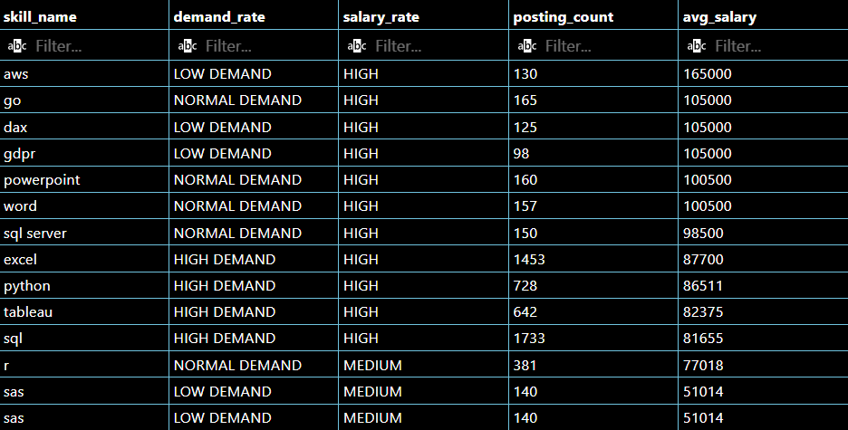
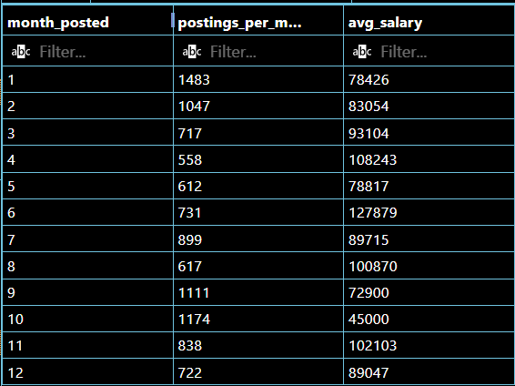
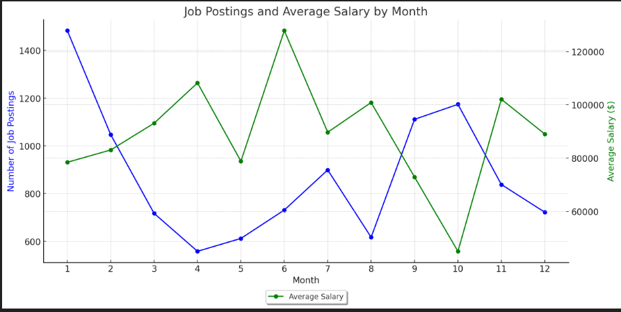

# INTRODUCTION

The purpose of this project is to maintain my SQL skills as well as identifying beneficial skills to progress my professional career as a Data Analyst within the UK.

As Data Analysts, we must always endeavour to practice and to use our skills as frequently as possible to ensure we can deliver the best results to our clients as efficiently as possible. 

I have included all SQL queries  [here!](/sql_project/)

# BACKGROUND

In this project, we look at data from job postings over the course of 2023. I have investigated and analysed this data to mark any trends.  

### The dataset showed

                    - jobs posted,
                    - job roles,
                    - jobs locations,
                    - skills specified in the job,
                    - posting details,
                    - and many more details

When working on this data, we focused on Data Analyst roles located in the United Kingdom.

### The Question's I wanted to answer

1. What skills were most desirable within the job market?

2. What were the highest paying skills in the job market?

3. What are the most effective skills to acquire in the job market? (what skills are in high demand and pay well?)

4. How do does recruitment change throughout the year?

# TOOLS USED
For this project, I utalised the power of the following tools:
* SQL - SQL qieries were the backbone of my analysis, allowing me to interagate the database and discover critical insights
* PostgreSQL - This database managment system was ideal for handling the data
* VSCODE - VSCODE is my go to for any code writting, allowing me to right my sql queries
* GITHUB - GITHUB allowed me to share my findings and allow you to see the work that i have produced!

# THE ANALYSIS
Each query in the project was designed to investigate specific aspects of the job market for Data Analysts within the United Kingdom. Here's how I approached each question.

## What skills were most desirable within the job market?
To identify the most desirable skills for data analysts in the UK, I would need to count the number of job postings which related to certain skills. This is the query which allowed me to do so:

``` SQL
SELECT
    COUNT(job_posting.job_id) AS number_of_jobs,
    skills.skills AS skill_name
FROM    
    job_postings_fact AS job_posting
LEFT JOIN
    skills_job_dim AS skills_to_job
    ON 
    job_posting.job_id = skills_to_job.job_id 
LEFT JOIN
    skills_dim AS skills
    ON
    skills_to_job.skill_id = skills.skill_id
WHERE
    job_country = 'United Kingdom'
    AND 
    job_title = 'Data Analyst'
GROUP BY
    skills.skills
ORDER BY
    number_of_jobs DESC
```

The data for the name of skills was stored on a separate table to the table for job postings. These two tables were linked by the skills_job_dim table. This meant I would have to use the join functions within SQL.

After successfully joining the 3 tables, I decided what columns I would need in my table. As we wanted the amount of job postings each skill had, I concluded that i would need an aggregate function to count the individual job_ids and a skill name column to show which skills were most in demand.

I then filtered down the query so that it would only display the jobs that I was interested in, Data Analyst roles located within the United Kingdom

### RESULTS
By running the query, it showed that the top 5 in demand skills for a data analyst in the UK are:
            
                SKILL               Job Postings            
                
                1. SQL          |    1733
                2. EXCEL        |    1453
                3. POWER BI     |    1061
                4. PYTHON       |    728
                5. TABLEAU      |    642

The highest demand skill in 2023 was SQL, followed by EXCE. This shows the emphasis on the need of strong fundamental skill for data processing and spreadsheet manipulation.

The highest demand Data Visualisation tool was Power BI which had 65% more demand than the next visualisation tool, TABLEAU. One possible reason for Power BI outperforming TABLEAU in this could be due to Power BI's interoperability incorporation into other Microsoft platforms such as EXCEL which also shows strong demand in the market.

When it comes to programming languages, Python reigns supreme. Python, with 728 posts, has over double the demand compared to its closest rival R, which only appeared in 381 posts. 

These results then naturally led to the following question...
  
## What were the highest paying skills in the job market
To identify the highest paid skills for a data analysed located in the UK, I would need to find the average salary that each skill was associated with. As I was only interested skills with specified salaries, I knew that for this query that I could disregard NULL results.

To do this, I created the following query:

```SQL
SELECT
    skills.skills AS skill_name,
    ROUND(AVG(job_posted.salary_year_avg)) AS avg_salary_per_skill
FROM
    job_postings_fact AS job_posted
LEFT JOIN
    skills_job_dim AS skills_to_job
    ON
    job_posted.job_id = skills_to_job.job_id
INNER JOIN
    skills_dim AS skills
    ON 
    skills_to_job.skill_id = skills.skill_id
WHERE
    job_country = 'United Kingdom'
    AND
    job_title = 'Data Analyst'
    AND 
    salary_year_avg IS NOT NULL
GROUP BY
    skill_name
ORDER BY    
    avg_salary_per_skill DESC
```

### RESULTS
From running this query, it showed that the highest paid skills were AWS and MYSQL both with average salary of $165,000. Surprisingly, none of the top 5 in demand skills were in the top 10 highest paid skills. in fact, Excel was the highest ranked skill for average pay that was in the top 5 in demand skills. This was because we were basing this query off of an average. This meant that the fewer postings a skill would have, the greater the biased to the skills overall average salary. 

This answered my question about what skill has the highest paying job but investigating my first query further, it became apparent that there isn't a high demand for jobs with these top paying skills.

This inspired my next question...

## What are the most effective skills to acquire in the job market?
So we now know what the most sought after skills are and we know the highest paying skills, but what skills are in high demand and pay well? The answer to this question will tell us what the most efficient skills are to study and upskill ourselves future employment.

To answer this question, we had to determine the amount of postings that were linked to a skill and the average salary that these job postings were advertising.

The data had many postings that didn't specify salary. Due to this, these postings were not included in determining the average salary related to skills. However, to have an accurate understanding of the demand of the skill, I chose to include these postings in the count of job postings per skill.

I also wanted to create 2 columns to rate both the amount of job postings and the average salary.

The query I used for this was:

```sql
-- CTE 1 START
WITH skill_salary AS 
(
    SELECT
        sjd.skill_id,
        ROUND(AVG(jp.salary_year_avg), 0) AS avg_salary
    FROM
        job_postings_fact AS jp
    JOIN
        skills_job_dim AS sjd 
        ON 
        jp.job_id = sjd.job_id
    WHERE
        jp.salary_year_avg IS NOT NULL
        AND jp.job_title = 'Data Analyst'
        AND jp.job_country = 'United Kingdom'
    GROUP BY
        sjd.skill_id
),
-- CTE 1 END

--CTE 2 START
skill_demand AS 
(
    SELECT
        sjd.skill_id,
        COUNT(jp.job_id) AS posting_count
    FROM
        job_postings_fact AS jp
    JOIN
        skills_job_dim AS sjd
        ON
        jp.job_id = sjd.job_id
    WHERE
        jp.job_title = 'Data Analyst'
        AND jp.job_country = 'United Kingdom'
    GROUP BY
        sjd.skill_id
)
-- CTE 2 END

--START OF MAIN QUERY

SELECT
    skills.skills AS skill_name,
    -- CASE 1 START
    CASE
        WHEN skill_demand.posting_count < 150 THEN 'LOW DEMAND'
        WHEN skill_demand.posting_count > 500 THEN 'HIGH DEMAND'
        ELSE 'NORMAL DEMAND'
    END AS demand_rate,
    -- CASE 1 END

    -- CASE 2 START
    CASE
        WHEN skill_salary.avg_salary < 50000 THEN 'LOW'
        WHEN skill_salary.avg_salary > 80000 THEN 'HIGH'
        ELSE 'MEDIUM'
    END AS salary_rate,
    -- CASE 2 END

    skill_demand.posting_count,
    skill_salary.avg_salary
FROM
    skill_salary 
-- JOIN 1
JOIN
    skill_demand 
    ON 
    skill_salary.skill_id = skill_demand.skill_id
--JOIN 2
JOIN
    skills_dim AS skills
     ON 
     skill_demand.skill_id = skills.skill_id
WHERE
    skill_demand.posting_count > 75
ORDER BY
    skill_salary.avg_salary DESC,
    skill_demand.posting_count DESC;
```
### RESULTS

*Results showing highest paid and most in demand skills for data analysts in the United Kingdom in 2023*

From this table we can see that by far, the highest skill is AWS with a salary of $165,000 however the demand for this was low with only 130 job postings desiring the skill in 2023. Therefore, we can assess that it wouldn’t be a high priority to learn compared to jobs which also have high average salaries related to them but with a much higher demand. 

These high demand, high paying skills include:
                    
* EXCEL
* PYTHON 
* TABLEAU
* SQL

When shown these results, I conclude that the most efficient upskilling would be focused on EXCEL as a priority due to its high salary and very high demand of 1453 postings. The demand is only beaten by SQL, with 1733 postings but has a slightly lower salary of $81,655. These 2 skills are what I’d assess to be the most important to master based on the data provided.

## How do does recruitment change throughout the year?

After seeing all the data on in demand skills and their relevant pay, we are readying ourselves for the job market.
So that poses the question, when is the best time to enter the job market?

I wanted to see what the trend of job postings would be throughout the year to best time job aplications and schedual courses accordingly in order to complete them before peaks in recruitment.

```SQL
SELECT
    EXTRACT(MONTH FROM  job_posted_date) AS month_posted,
    COUNT(*) AS postings_per_month,
    ROUND(AVG(salary_year_avg)) AS avg_salary
FROM  
    job_postings_fact
WHERE
    job_title_short  = 'Data Analyst'
    AND
    job_country = 'United Kingdom'
GROUP BY
    month_posted
ORDER BY
    month_posted 
```

### RESULTS 

***Results of the query in table form***

To Better understand these results, I created a graph to better disply them.

 
***Graph showing the trend of number of job postings and salaries throughout the year. The green plots refer to average salary per month. The blue plots refer to the number of job postings per month***

From the graph, we can see that job Postings peak in January and October and fall in April and December. This trend likely reflects typical hiring cycles, with companies hiring at the start of the year and again in the fall.

Salaries tend to peak during specific months (April and June) when high-paying roles may be posted. The significant drop in October suggests a focus on lower-paying jobs during that period.

This analysis highlights how hiring activity and salary offerings vary throughout the year, likely influenced by economic cycles, company budget cycles, and seasonal hiring patterns.

These results indicate that the best time to job hunt would be the start of the year (January & February) to capitalise on the high demand whilst taking advantage of the high salary offerings. May appears to be one of the worst months for job postings and salary offerings

# CONCLUSION
To conclude, I started this project in order to practice and build on my SQL skills whilst presenting them to an audience. I also deeply interested in the trends of skill demand in data analysis in order to plan my own transition from data analysis in a military capacity to commercial data analysis.

 During this project, I have assessed that the highest paid skills as a data analyst in the UK are cloud based database systems such as AWS however the demand for these skills are relatively low. The most in demand skills are that are also high paying are the classics such as EXCEL, PYTHON, TABLEAU and of course, SQL whose demand dominates the job market. This shows that the classic skills are the best to focus on during upskilling in order to best suit to employers.

 Through this project I have also concluded that the best time to enter the job market is in the first quarter of the year, with demand and offered salaries both being relatively high in this period, along with September which also shares the same characteristics. 

 Overall, his project has helped me plan out a timetable for my upskilling future employment opportunities over the next 12 months.

# MY COMMENTS 

As previously discussed, I mainly started this project in order to improve and put into practice my SQL skills in a bid to help me to transition to civilian employment.

### What was used
This project has allowed me to utilise skills I have developed over the past few years of employment such as:
* Creating Tables
* Aggregate functions
* Joining Tables
* Sub-Queries and CTE's
* CASE statements
* Grouping

### Skills improved

Over the course of this project, I have become more comfortable using CTE's in queries in a way I wasn’t before. Along with this, I feel a deeper understanding of CASE expressions. During this project, these two skills suddenly 'clicked' in a way they just hadn’t before. This shows the importance repetition and practice with all skills.

### Closing points

Overall, this project was great fun. The more experience you have with problem solving errors, the quicker and easier fault finding will be. On this project the bulk of my fault finding involved searching for an odd typo here and there or fixing syntax errors. Fault finding and problem solving are 2 of the biggest parts of the job from my experience, and it’s always satisfying when you solve them.

Thanks for tanking your time to read this and if you have any comments feel free to drop a message, it’d be much appreciated.

